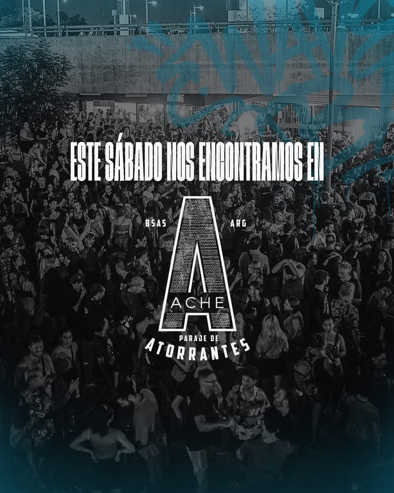

# Wave Bass Rave

Landing page para Wave Bass Rave, productora de eventos de música electrónica de Buenos Aires. El sitio reúne las fechas, la academia de DJ y producción, el sello discográfico y el archivo fotográfico de las ediciones anteriores.

**Ver el sitio:** [wavebassrave.com](https://wavebassrave.com)



---

## Sobre el proyecto

La productora necesitaba una sola página que funcionara como centro de todo: vender entradas, mostrar la academia, difundir los lanzamientos del sello y recibir solicitudes de DJ. La referencia estética fueron los sitios de festivales europeos —oscuros, con foco en el material audiovisual y tipografía marcada.

Está construido sin frameworks: HTML, SCSS y JavaScript. La decisión fue deliberada — para un sitio de una sola página, sumar una capa de build agregaría complejidad sin beneficio real, y así carga más rápido.

## Decisiones de diseño

**Paleta reducida a tres colores.** Negro, blanco y celeste. Con una sola familia de color, el celeste queda reservado para lo accionable: botones, links y datos clave. El ojo aprende enseguida dónde mirar.

**Video de fondo con velo.** El header usa material de las fiestas con un degradé encima, que cumple dos funciones: garantiza que el texto se lea sin importar qué fotograma esté pasando, y unifica el material de video con la paleta del sitio.

**Título sin resplandor.** La primera versión usaba `text-shadow` para dar impacto, pero se veía amateur. Lo reemplacé por un degradé recortado sobre el texto que se desplaza muy lento: da vida sin gritar.

**Secciones alternadas.** Los fondos alternan entre dos negros casi idénticos mediante `nth-of-type`. La diferencia es mínima pero suficiente para que la página no se lea como un bloque continuo, y no requiere clases extra en el HTML.

## Detalles técnicos

**HTML solo para estructura.** No hay un solo atributo `style` ni clases utilitarias apiladas. Cada elemento lleva una clase que describe qué es (`.evento-destacado__fecha`), y el SCSS define cómo se ve. El HTML se lee como un índice del contenido.

**SCSS con placeholders.** Las recetas compartidas viven en placeholders (`%caja-media`, `%boton`, `%texto-etiqueta`) y se aplican con `@extend`. Cambiar el aspecto de todos los botones del sitio es editar una regla.

**Traducción ES/EN funcional.** Cada texto lleva su versión en inglés en un atributo `data-en`. El script guarda el original al cargar y alterna entre ambos, incluidos los `placeholder` de los formularios y las opciones del select. También actualiza el atributo `lang` del documento.

**Apariciones al scrollear.** Un `IntersectionObserver` agrega la clase que dispara la animación y deja de observar el elemento. Una versión anterior animaba también la salida, pero hacía que la página se sintiera inestable al scrollear y multiplicaba el trabajo del navegador en cada cuadro.

**SEO.** Metadatos Open Graph y Twitter Card para que el link se vea bien al compartirse, y datos estructurados JSON-LD del tipo `MusicEvent` para que Google pueda mostrar la fecha y el lugar del evento directamente en los resultados.

## Estructura

```
├── index.html          Estructura y contenido
├── styles.scss         Fuente de estilos
├── styles.css          CSS compilado
├── script.js           Scroll reveal, carga de imágenes y traductor
├── robots.txt
├── sitemap.xml
└── Multimedia/         Video, flyers, fotos y tapas
```

## Correr el proyecto

Al ser un sitio estático, alcanza con abrir `index.html` en el navegador. Para desarrollo conviene un servidor local (la extensión Live Server de VS Code, por ejemplo).

Si vas a modificar los estilos, editá `styles.scss` y compilá:

```bash
npm install -g sass
sass --watch styles.scss styles.css
```

## Pendientes

- Conectar el formulario de contacto a un servicio de envío
- Integrar la plataforma de venta de entradas
- Versiones responsive de las imágenes con `srcset`

---

Diseñado y desarrollado por **Francisco (Franky)**
